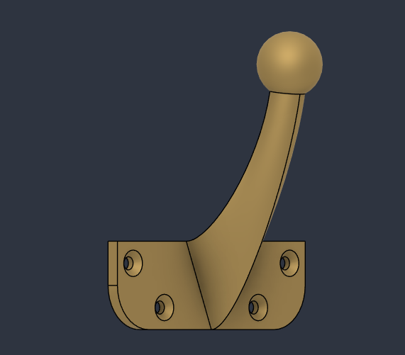
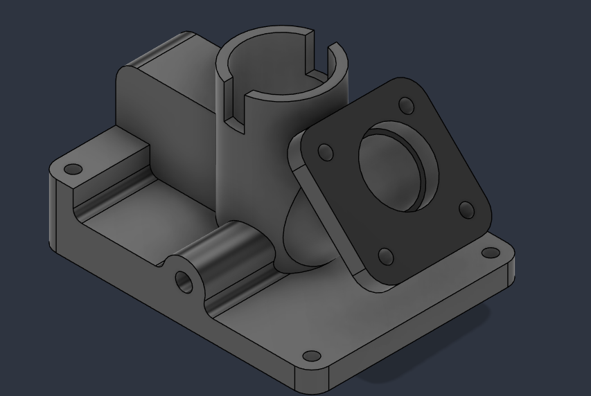
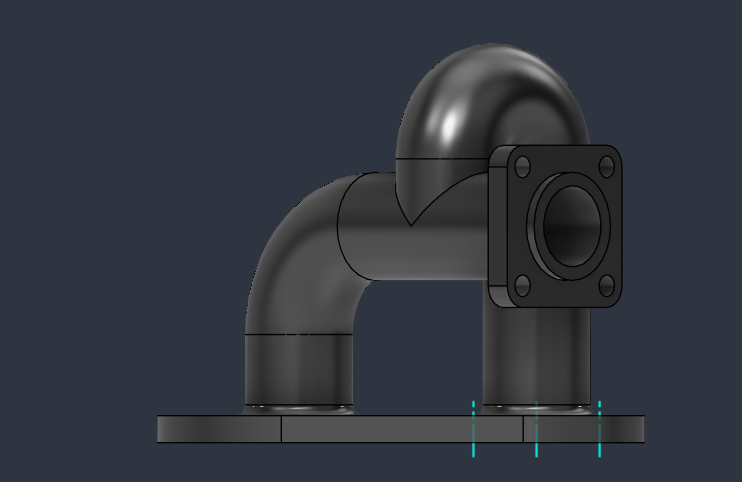
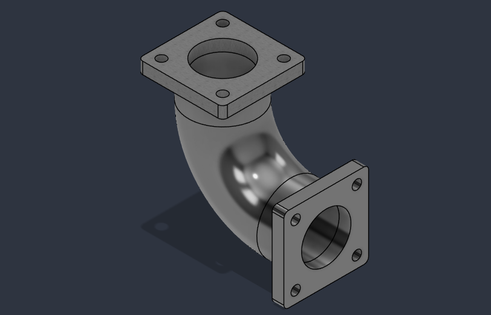
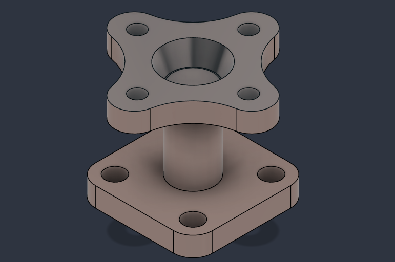

# 🔧 Mechanical Components Design Collection

### Autodesk Fusion 360 CAD Models

This repository contains a collection of mechanical components designed in Autodesk Fusion 360. Each project helped me explore different CAD tools, modeling techniques, and design concepts while improving my understanding of mechanical design.

---

## 🛠 Software Used

- Autodesk Fusion 360

---

## 📂 Projects

### 1. Wall-Mounted Hook Design

At first, this looked like a simple model, but creating the smooth transition between the hook and base introduced me to the Loft feature. After a few attempts, I understood why lofts are such a powerful tool for creating organic shapes.

---

### 2. Pipe Support Bracket Design

This model was completed as part of a course assessment. It challenged me to combine several Fusion 360 features into a single design and served as an excellent revision of the fundamentals.

---

### 3. Pipe Elbow Assembly

This project made me appreciate the Sweep feature. Watching a simple profile follow a path and become a realistic pipe component showed how efficient CAD tools can be.

---

### 4. Flanged Elbow Pipe Fitting

Building on the elbow assembly, this model introduced flange features commonly used in industrial piping systems and reinforced the importance of dimensional accuracy.

---

### 5. Flanged Support Spacer Design

Although the geometry appears straightforward, maintaining alignment between multiple features required careful planning and attention to detail.

---

### 6. Butt Hinge Design

I expected this to be one of the easiest models in the collection. It turned out to be a great lesson in understanding how simple mechanical components work together, proving that even everyday objects involve thoughtful engineering.

🎥 Motion Demonstration: Hinge.mp4

---

## 📚 Skills Demonstrated

- Autodesk Fusion 360
- CAD Modeling
- Parametric Design
- Mechanical Design
- Assembly Design
- Product Design

---

**Praneesha**  
Mechanical Engineering Student | IIT Jodhpur
